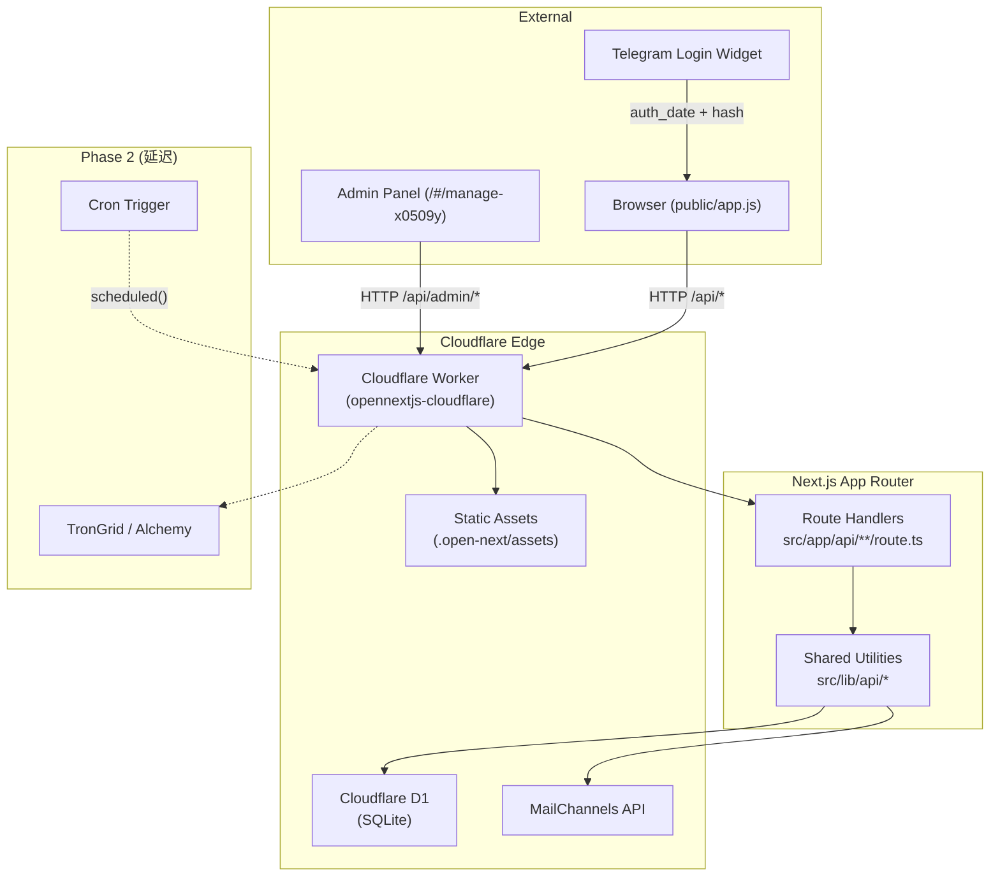
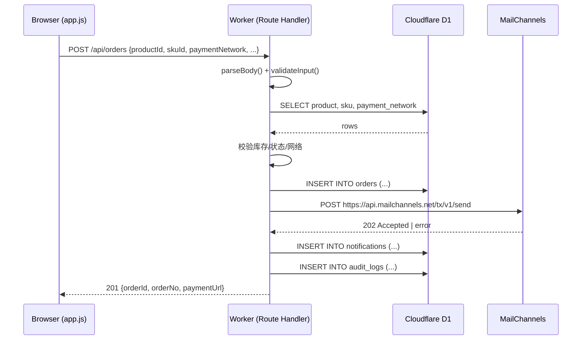
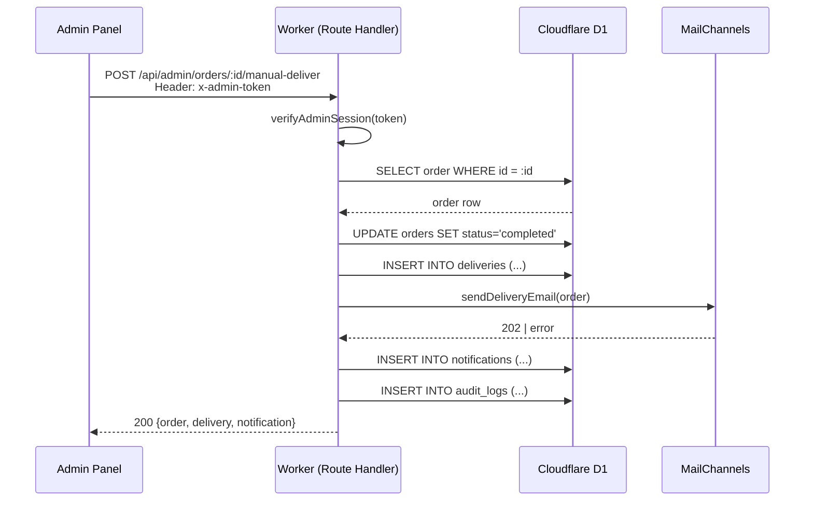
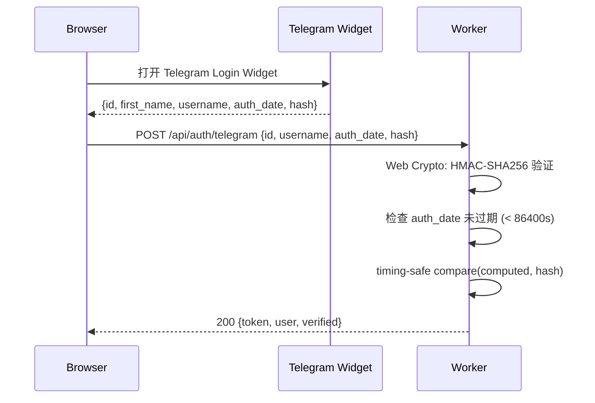

# 设计文档：Cloudflare Backend Migration

## 概述

ichuhai 是一个虚拟数字商品商城，当前生产站点 `ichuhai.shop` 通过 `opennextjs-cloudflare build` + `wrangler deploy` 部署，但所有后端逻辑仍驻留在独立的 Node HTTP 服务器 `server.mjs` 中（依赖 `node:http`、`node:fs`、`node:crypto`、nodemailer、长驻 Worker 进程），导致 `/api/*` 路由在 Cloudflare Workers 上全部返回 404。

本设计将 `server.mjs` 中的全部 API 逻辑迁移至 Next.js App Router Route Handlers（`src/app/api/**/route.ts`），数据层从 `data/db.json` 迁移至 Cloudflare D1（边缘 SQLite），邮件从 nodemailer/SMTP 迁移至 MailChannels（Workers 免费发信），加密操作从 Node `crypto` 迁移至 Web Crypto API。迁移后 `wrangler deploy` 即可获得完整可用的生产后端。

Phase 1 仅实现 MOCK/手动支付确认（管理员标记已付 + 手动发货）。链上监听（Cron Trigger → TronGrid/Alchemy）为 Phase 2，本文档仅标注集成点。

## 架构



## 路由映射

完整的 `server.mjs` 端点到 Next.js Route Handler 的映射：

| server.mjs 端点 | HTTP 方法 | Route Handler 路径 | 文件 |
|---|---|---|---|
| `/api/config` | GET | `/api/config` | `src/app/api/config/route.ts` |
| `/api/products` | GET | `/api/products` | `src/app/api/products/route.ts` |
| `/api/products/:slug` | GET | `/api/products/[slug]` | `src/app/api/products/[slug]/route.ts` |
| `/api/exchange-rates` | GET | `/api/exchange-rates` | `src/app/api/exchange-rates/route.ts` |
| `/api/payment-networks` | GET | `/api/payment-networks` | `src/app/api/payment-networks/route.ts` |
| `/api/orders` | POST | `/api/orders` | `src/app/api/orders/route.ts` |
| `/api/orders/lookup` | POST | `/api/orders/lookup` | `src/app/api/orders/lookup/route.ts` |
| `/api/orders/:id/payment` | GET | `/api/orders/[id]/payment` | `src/app/api/orders/[id]/payment/route.ts` |
| `/api/orders/:id/status` | GET | `/api/orders/[id]/status` | `src/app/api/orders/[id]/status/route.ts` |
| `/api/orders/:id/txhash` | POST | `/api/orders/[id]/txhash` | `src/app/api/orders/[id]/txhash/route.ts` |
| `/api/orders/:id/tickets` | POST | `/api/orders/[id]/tickets` | `src/app/api/orders/[id]/tickets/route.ts` |
| `/api/auth/telegram` | POST | `/api/auth/telegram` | `src/app/api/auth/telegram/route.ts` |
| `/api/me/preferences` | PATCH | `/api/me/preferences` | `src/app/api/me/preferences/route.ts` |
| `/api/admin/login` | POST | `/api/admin/login` | `src/app/api/admin/login/route.ts` |
| `/api/admin/orders` | GET | `/api/admin/orders` | `src/app/api/admin/orders/route.ts` |
| `/api/admin/orders/:id/status` | PATCH | `/api/admin/orders/[id]/status` | `src/app/api/admin/orders/[id]/status/route.ts` |
| `/api/admin/orders/:id/manual-deliver` | POST | `/api/admin/orders/[id]/manual-deliver` | `src/app/api/admin/orders/[id]/manual-deliver/route.ts` |
| `/api/admin/products` | POST | `/api/admin/products` | `src/app/api/admin/products/route.ts` |
| `/api/admin/products/:id` | PATCH | `/api/admin/products/[id]` | `src/app/api/admin/products/[id]/route.ts` |
| `/api/admin/skus` | POST | `/api/admin/skus` | `src/app/api/admin/skus/route.ts` |
| `/api/admin/skus/:id` | PATCH | `/api/admin/skus/[id]` | `src/app/api/admin/skus/[id]/route.ts` |
| `/api/admin/skus/batch-generate` | POST | `/api/admin/skus/batch-generate` | `src/app/api/admin/skus/batch-generate/route.ts` |
| `/api/admin/inventory/import` | POST | `/api/admin/inventory/import` | `src/app/api/admin/inventory/import/route.ts` |
| `/api/admin/payment-networks` | GET | `/api/admin/payment-networks` | `src/app/api/admin/payment-networks/route.ts` |
| `/api/admin/payment-networks/:id` | PATCH | `/api/admin/payment-networks/[id]` | `src/app/api/admin/payment-networks/[id]/route.ts` |
| `/api/admin/deliveries` | GET | `/api/admin/deliveries` | `src/app/api/admin/deliveries/route.ts` |
| `/api/admin/notifications` | GET | `/api/admin/notifications` | `src/app/api/admin/notifications/route.ts` |
| `/api/admin/support-tickets` | GET | `/api/admin/support-tickets` | `src/app/api/admin/support-tickets/route.ts` |
| `/api/internal/orders/:id/mark-paid` | POST | `/api/internal/orders/[id]/mark-paid` | `src/app/api/internal/orders/[id]/mark-paid/route.ts` |
| `/api/internal/orders/:id/deliver` | POST | `/api/internal/orders/[id]/deliver` | `src/app/api/internal/orders/[id]/deliver/route.ts` |

> 所有路由均需导出 `OPTIONS` handler 以支持 CORS preflight。

## 时序图

### 用户下单流程



### 管理员手动发货流程



### Telegram 登录验证



## D1 数据库 Schema (DDL)

```sql
-- 0001_initial.sql

PRAGMA journal_mode = WAL;
PRAGMA foreign_keys = ON;

-- 商品表
CREATE TABLE products (
  id TEXT PRIMARY KEY,
  slug TEXT NOT NULL UNIQUE,
  name TEXT NOT NULL,
  category_id TEXT NOT NULL DEFAULT 'more',
  status TEXT NOT NULL DEFAULT 'active' CHECK(status IN ('active','hidden','archived')),
  delivery_type TEXT NOT NULL DEFAULT 'manual' CHECK(delivery_type IN ('auto','manual','mixed')),
  base_currency TEXT NOT NULL DEFAULT 'USDT',
  created_at TEXT NOT NULL DEFAULT (datetime('now')),
  updated_at TEXT NOT NULL DEFAULT (datetime('now'))
);

CREATE INDEX idx_products_slug ON products(slug);
CREATE INDEX idx_products_status ON products(status);

-- SKU 表
CREATE TABLE skus (
  id TEXT PRIMARY KEY,
  product_id TEXT NOT NULL REFERENCES products(id),
  option_values TEXT NOT NULL DEFAULT '{}',  -- JSON
  price_usdt TEXT NOT NULL,
  stock_status TEXT NOT NULL DEFAULT 'in_stock' CHECK(stock_status IN ('in_stock','low_stock','sold_out')),
  stock_quantity INTEGER NOT NULL DEFAULT 0,
  delivery_type TEXT NOT NULL DEFAULT 'manual' CHECK(delivery_type IN ('auto','manual','mixed')),
  is_default INTEGER NOT NULL DEFAULT 0,
  is_recommended INTEGER NOT NULL DEFAULT 0,
  created_at TEXT NOT NULL DEFAULT (datetime('now')),
  updated_at TEXT NOT NULL DEFAULT (datetime('now'))
);

CREATE INDEX idx_skus_product_id ON skus(product_id);

-- 支付网络表
CREATE TABLE payment_networks (
  id TEXT PRIMARY KEY,
  code TEXT NOT NULL UNIQUE,
  display_name TEXT NOT NULL,
  token_standard TEXT NOT NULL,
  is_enabled INTEGER NOT NULL DEFAULT 1,
  is_recommended INTEGER NOT NULL DEFAULT 0,
  address TEXT NOT NULL,
  confirmations INTEGER NOT NULL DEFAULT 1,
  warning_text TEXT,
  created_at TEXT NOT NULL DEFAULT (datetime('now')),
  updated_at TEXT NOT NULL DEFAULT (datetime('now'))
);

-- 汇率表
CREATE TABLE exchange_rates (
  currency TEXT PRIMARY KEY,
  rate TEXT NOT NULL,
  updated_at TEXT NOT NULL DEFAULT (datetime('now'))
);

-- 用户表
CREATE TABLE users (
  id TEXT PRIMARY KEY,
  telegram_id TEXT NOT NULL UNIQUE,
  telegram_username TEXT NOT NULL,
  default_currency TEXT NOT NULL DEFAULT 'CNY',
  last_login_at TEXT NOT NULL DEFAULT (datetime('now')),
  created_at TEXT NOT NULL DEFAULT (datetime('now'))
);

CREATE INDEX idx_users_telegram_id ON users(telegram_id);

-- 订单表
CREATE TABLE orders (
  id TEXT PRIMARY KEY,
  order_no TEXT NOT NULL UNIQUE,
  product_id TEXT NOT NULL,
  sku_id TEXT NOT NULL,
  product_snapshot TEXT NOT NULL,  -- JSON
  sku_snapshot TEXT NOT NULL,      -- JSON
  telegram_username TEXT NOT NULL,
  email TEXT NOT NULL,
  amount_usdt TEXT NOT NULL,
  fiat_currency TEXT NOT NULL DEFAULT 'USD',
  fiat_amount_snapshot TEXT,
  exchange_rate_snapshot TEXT,
  payment_currency TEXT NOT NULL DEFAULT 'USDT',
  payment_network TEXT NOT NULL,
  payment_address TEXT NOT NULL,
  status TEXT NOT NULL DEFAULT 'pending_payment' CHECK(status IN ('created','pending_payment','payment_confirming','paid','delivering','completed','expired','failed','refunding','refunded')),
  tx_hash TEXT,
  paid_at TEXT,
  delivered_at TEXT,
  admin_note TEXT,
  expires_at TEXT NOT NULL,
  created_at TEXT NOT NULL DEFAULT (datetime('now')),
  updated_at TEXT NOT NULL DEFAULT (datetime('now'))
);

CREATE INDEX idx_orders_order_no ON orders(order_no);
CREATE INDEX idx_orders_status ON orders(status);
CREATE INDEX idx_orders_tx_hash ON orders(tx_hash);
CREATE INDEX idx_orders_email ON orders(email);
CREATE INDEX idx_orders_telegram ON orders(telegram_username);

-- 发货记录表
CREATE TABLE deliveries (
  id TEXT PRIMARY KEY,
  order_id TEXT NOT NULL REFERENCES orders(id),
  method TEXT NOT NULL,
  operator TEXT,
  channel TEXT NOT NULL DEFAULT '["telegram","email"]',  -- JSON array
  masked_content TEXT NOT NULL,
  created_at TEXT NOT NULL DEFAULT (datetime('now'))
);

CREATE INDEX idx_deliveries_order_id ON deliveries(order_id);

-- 通知记录表
CREATE TABLE notifications (
  id TEXT PRIMARY KEY,
  order_id TEXT,
  channel TEXT NOT NULL,
  type TEXT NOT NULL,
  provider TEXT NOT NULL,
  status TEXT NOT NULL DEFAULT 'pending',
  message_id TEXT,
  error TEXT,
  created_at TEXT NOT NULL DEFAULT (datetime('now'))
);

CREATE INDEX idx_notifications_order_id ON notifications(order_id);

-- 工单表
CREATE TABLE support_tickets (
  id TEXT PRIMARY KEY,
  ticket_no TEXT NOT NULL UNIQUE,
  order_id TEXT NOT NULL REFERENCES orders(id),
  order_no TEXT NOT NULL,
  type TEXT NOT NULL DEFAULT 'after_sales',
  description TEXT NOT NULL,
  status TEXT NOT NULL DEFAULT 'open' CHECK(status IN ('open','in_progress','resolved','closed')),
  created_at TEXT NOT NULL DEFAULT (datetime('now')),
  updated_at TEXT NOT NULL DEFAULT (datetime('now'))
);

CREATE INDEX idx_tickets_order_id ON support_tickets(order_id);

-- 审计日志表
CREATE TABLE audit_logs (
  id TEXT PRIMARY KEY,
  actor_id TEXT NOT NULL,
  actor_role TEXT NOT NULL,
  action TEXT NOT NULL,
  target TEXT NOT NULL,
  target_id TEXT NOT NULL,
  ip TEXT,
  user_agent TEXT,
  metadata TEXT DEFAULT '{}',  -- JSON
  created_at TEXT NOT NULL DEFAULT (datetime('now'))
);

CREATE INDEX idx_audit_actor ON audit_logs(actor_id);
CREATE INDEX idx_audit_target ON audit_logs(target, target_id);

-- 库存项表（加密存储）
CREATE TABLE inventory_items (
  id TEXT PRIMARY KEY,
  sku_id TEXT NOT NULL REFERENCES skus(id),
  masked_value TEXT NOT NULL,
  encrypted_value TEXT NOT NULL,
  status TEXT NOT NULL DEFAULT 'available' CHECK(status IN ('available','reserved','delivered','revoked')),
  order_id TEXT,
  created_at TEXT NOT NULL DEFAULT (datetime('now'))
);

CREATE INDEX idx_inventory_sku ON inventory_items(sku_id, status);
```

## Seed 策略

采用 **wrangler d1 migrations** 方案：

```
migrations/
├── 0001_initial.sql          -- 上述 DDL
└── 0002_seed.sql             -- 初始数据
```

`0002_seed.sql` 内容从 `server.mjs` 的 `seed` 对象直接转换为 INSERT 语句：

```sql
-- 0002_seed.sql

INSERT INTO products (id, slug, name, category_id, status, delivery_type) VALUES
  ('discord-nitro', 'discord-nitro', 'Discord Nitro', 'social', 'active', 'auto'),
  ('spotify-premium', 'spotify-premium', 'Spotify Premium', 'music', 'active', 'auto'),
  ('youtube-premium', 'youtube-premium', 'YouTube Premium', 'video', 'active', 'mixed'),
  ('steam-wallet', 'steam-wallet', 'Steam Wallet', 'game', 'active', 'manual'),
  ('microsoft-365', 'microsoft-365', 'Microsoft 365', 'software', 'active', 'auto');

INSERT INTO skus (id, product_id, option_values, price_usdt, stock_status, delivery_type, is_default) VALUES
  ('dn-g-new-1', 'discord-nitro', '{"region":"Global","account_type":"新号","duration":"1个月"}', '1.80', 'in_stock', 'auto', 1),
  ('dn-g-new-3', 'discord-nitro', '{"region":"Global","account_type":"新号","duration":"3个月"}', '4.80', 'in_stock', 'auto', 0),
  ('dn-g-new-12', 'discord-nitro', '{"region":"Global","account_type":"新号","duration":"12个月"}', '16.20', 'in_stock', 'auto', 0),
  ('dn-us-old-1', 'discord-nitro', '{"region":"US","account_type":"老号","duration":"1个月"}', '2.10', 'low_stock', 'manual', 0),
  ('dn-eu-share-3', 'discord-nitro', '{"region":"EU","account_type":"共享","duration":"3个月"}', '3.90', 'in_stock', 'auto', 0),
  ('dn-jp-new-1', 'discord-nitro', '{"region":"JP","account_type":"新号","duration":"1个月"}', '2.30', 'sold_out', 'manual', 0),
  ('sp-1', 'spotify-premium', '{"duration":"1个月"}', '2.20', 'in_stock', 'auto', 1),
  ('sp-3', 'spotify-premium', '{"duration":"3个月"}', '6.10', 'in_stock', 'auto', 0),
  ('sp-12', 'spotify-premium', '{"duration":"12个月"}', '21.80', 'low_stock', 'auto', 0),
  ('yt-g-1', 'youtube-premium', '{"region":"Global","duration":"1个月"}', '2.50', 'in_stock', 'auto', 1),
  ('yt-us-12', 'youtube-premium', '{"region":"US","duration":"12个月"}', '24.00', 'in_stock', 'manual', 0),
  ('sw-5', 'steam-wallet', '{"amount":"5 USD"}', '5.00', 'in_stock', 'manual', 1),
  ('sw-10', 'steam-wallet', '{"amount":"10 USD"}', '10.00', 'in_stock', 'manual', 0),
  ('sw-20', 'steam-wallet', '{"amount":"20 USD"}', '20.00', 'low_stock', 'manual', 0),
  ('ms-personal', 'microsoft-365', '{"plan":"个人版"}', '3.50', 'in_stock', 'auto', 1),
  ('ms-family', 'microsoft-365', '{"plan":"家庭版"}', '8.80', 'in_stock', 'auto', 0);

INSERT INTO payment_networks (id, code, display_name, token_standard, is_enabled, is_recommended, address, confirmations) VALUES
  ('net_tron', 'TRON', 'TRON', 'TRC20', 1, 1, 'TXL8d1e7hVKZy8vY8g9a6n3sJX4mP6u6wJ', 1),
  ('net_eth', 'ETH', 'ETH', 'ERC20', 1, 0, '0x7fE9A4b11cE5A9E2fA40eB3fA2465d9E4c07F001', 12),
  ('net_bsc', 'BSC', 'BSC', 'BEP20', 1, 0, '0xB35b2C2f9B5f3A7D61d5b3f82D82d9a89Ce7b002', 15),
  ('net_base', 'BASE', 'BASE', 'ERC20', 1, 0, '0xBA5E000000000000000000000000000000000001', 12);

INSERT INTO exchange_rates (currency, rate) VALUES
  ('USD', '1'), ('CNY', '7.22'), ('GBP', '0.79'), ('EUR', '0.93'),
  ('AUD', '1.52'), ('JPY', '155'), ('HKD', '7.82'), ('KRW', '1360');
```

执行方式：

```bash
# 本地开发
wrangler d1 migrations apply ichuhai-db --local

# 生产部署
wrangler d1 migrations apply ichuhai-db --remote
```

## 组件与接口

### 共享工具库 (`src/lib/api/`)

文件结构：

```
src/lib/api/
├── d1.ts              -- D1 客户端获取
├── body-parser.ts     -- 请求体解析 + 大小限制
├── cors.ts            -- CORS + 安全响应头
├── admin-session.ts   -- HMAC 管理员会话
├── telegram-auth.ts   -- Telegram 登录验证 (Web Crypto)
├── inventory-crypto.ts -- AES-256-GCM 加解密 (Web Crypto)
├── audit.ts           -- 审计日志写入
├── notifications.ts   -- 通知持久化
├── mailer.ts          -- MailChannels 发信
├── validators.ts      -- 输入校验工具函数
└── errors.ts          -- HttpError 类 + 统一错误响应
```

### 组件 1：D1 客户端 (`src/lib/api/d1.ts`)

**用途**：通过 `@opennextjs/cloudflare` 获取 D1 binding

```typescript
import { getCloudflareContext } from "@opennextjs/cloudflare";

export async function getD1(): Promise<D1Database> {
  const { env } = await getCloudflareContext();
  return env.DB;
}
```

**职责**：
- 提供统一的 D1 数据库访问入口
- 封装 `getCloudflareContext()` 调用，避免各 route handler 重复引用

### 组件 2：请求体解析器 (`src/lib/api/body-parser.ts`)

**用途**：解析 JSON 请求体并强制大小限制

```typescript
const MAX_BODY_BYTES = 131072; // 128KB

export async function parseBody<T = Record<string, unknown>>(
  request: Request
): Promise<T> {
  const contentType = request.headers.get("content-type") || "";
  if (request.method !== "GET" && contentType && !contentType.includes("application/json")) {
    throw new HttpError(415, "content-type must be application/json");
  }
  const raw = await request.text();
  if (new TextEncoder().encode(raw).byteLength > MAX_BODY_BYTES) {
    throw new HttpError(413, "request body too large");
  }
  if (!raw) return {} as T;
  try {
    return JSON.parse(raw) as T;
  } catch {
    throw new HttpError(400, "invalid json body");
  }
}
```

**职责**：
- 强制 `MAX_BODY_BYTES` (128KB) 限制
- 校验 Content-Type 为 `application/json`
- 返回解析后的 JSON 对象

### 组件 3：CORS + 安全头 (`src/lib/api/cors.ts`)

**用途**：生成安全响应头，处理 CORS preflight

```typescript
import { getCloudflareContext } from "@opennextjs/cloudflare";

export function securityHeaders(request: Request, env: CloudflareEnv): HeadersInit {
  const origin = (request.headers.get("origin") || "").replace(/\/$/, "");
  const allowed = new Set([
    env.PUBLIC_SITE_URL,
    ...(env.ALLOWED_ORIGINS || "").split(",").filter(Boolean).map(s => s.trim().replace(/\/$/, ""))
  ]);
  const headers: Record<string, string> = {
    "x-content-type-options": "nosniff",
    "referrer-policy": "strict-origin-when-cross-origin",
    "cache-control": "no-store",
    "vary": "Origin",
  };
  if (origin && allowed.has(origin)) {
    headers["access-control-allow-origin"] = origin;
    headers["access-control-allow-methods"] = "GET,POST,PATCH,OPTIONS";
    headers["access-control-allow-headers"] = "content-type,x-admin-token,x-internal-token";
  }
  return headers;
}

export function jsonResponse(data: unknown, status: number, request: Request, env: CloudflareEnv): Response {
  return new Response(JSON.stringify(data), {
    status,
    headers: {
      "content-type": "application/json; charset=utf-8",
      ...securityHeaders(request, env),
    },
  });
}

export function optionsResponse(request: Request, env: CloudflareEnv): Response {
  return new Response(null, { status: 204, headers: securityHeaders(request, env) });
}
```

**职责**：
- 维护 origin 白名单（`PUBLIC_SITE_URL` + `ALLOWED_ORIGINS`）
- 生成标准安全头（nosniff、referrer-policy、cache-control）
- 提供统一的 JSON 响应构造器
- 处理 OPTIONS preflight

### 组件 4：管理员 HMAC 会话 (`src/lib/api/admin-session.ts`)

**用途**：创建和验证管理员 session token（HMAC-SHA256）

```typescript
export async function createAdminSessionToken(env: CloudflareEnv): Promise<string> {
  const payload = btoa(JSON.stringify({
    role: "admin",
    nonce: crypto.randomUUID(),
    exp: Date.now() + 12 * 60 * 60 * 1000, // 12h TTL
  }));
  const signature = await signPayload(payload, env.ADMIN_SESSION_SECRET);
  return `${payload}.${signature}`;
}

export async function verifyAdminSessionToken(token: string, env: CloudflareEnv): Promise<boolean> {
  const [payload, signature] = (token || "").split(".");
  if (!payload || !signature) return false;
  const expected = await signPayload(payload, env.ADMIN_SESSION_SECRET);
  if (!timingSafeEqual(signature, expected)) return false;
  try {
    const session = JSON.parse(atob(payload));
    return session.role === "admin" && Number(session.exp) > Date.now();
  } catch {
    return false;
  }
}

async function signPayload(payload: string, secret: string): Promise<string> {
  const key = await crypto.subtle.importKey(
    "raw",
    new TextEncoder().encode(secret),
    { name: "HMAC", hash: "SHA-256" },
    false,
    ["sign"]
  );
  const sig = await crypto.subtle.sign("HMAC", key, new TextEncoder().encode(payload));
  return btoa(String.fromCharCode(...new Uint8Array(sig)))
    .replace(/\+/g, "-").replace(/\//g, "_").replace(/=+$/, "");
}

function timingSafeEqual(a: string, b: string): boolean {
  const enc = new TextEncoder();
  const bufA = enc.encode(a);
  const bufB = enc.encode(b);
  if (bufA.byteLength !== bufB.byteLength) return false;
  let result = 0;
  for (let i = 0; i < bufA.byteLength; i++) {
    result |= bufA[i] ^ bufB[i];
  }
  return result === 0;
}
```

**职责**：
- 使用 Web Crypto HMAC-SHA256 签名 payload
- 12 小时 TTL 过期检查
- timing-safe 比较防止时序攻击

### 组件 5：Telegram 登录验证 (`src/lib/api/telegram-auth.ts`)

**用途**：验证 Telegram Login Widget 回调数据

```typescript
export async function verifyTelegramLogin(
  data: Record<string, string>,
  botToken: string
): Promise<{ ok: boolean; reason?: string }> {
  if (!data.hash) return { ok: false, reason: "missing hash" };
  const { hash, ...rest } = data;
  const dataCheckString = Object.keys(rest).sort().map(k => `${k}=${rest[k]}`).join("\n");

  // SHA-256(bot_token) 作为 HMAC 密钥
  const secretKeyData = await crypto.subtle.digest("SHA-256", new TextEncoder().encode(botToken));
  const key = await crypto.subtle.importKey("raw", secretKeyData, { name: "HMAC", hash: "SHA-256" }, false, ["sign"]);
  const sig = await crypto.subtle.sign("HMAC", key, new TextEncoder().encode(dataCheckString));
  const computedHash = Array.from(new Uint8Array(sig)).map(b => b.toString(16).padStart(2, "0")).join("");

  const expired = data.auth_date && (Date.now() / 1000 - Number(data.auth_date)) > 86400;
  if (expired) return { ok: false, reason: "auth_date expired" };
  if (!timingSafeEqual(computedHash, hash)) return { ok: false, reason: "hash mismatch" };
  return { ok: true };
}
```

**职责**：
- 使用 Web Crypto 替代 Node `crypto.createHmac`
- 按 Telegram 规范排序字段并计算 HMAC
- 检查 `auth_date` 是否在 24 小时内
- timing-safe 比较

### 组件 6：库存加解密 (`src/lib/api/inventory-crypto.ts`)

**用途**：AES-256-GCM 加密库存项（Web Crypto 实现）

```typescript
export async function encryptInventoryValue(value: string, encryptionKey: string): Promise<string> {
  const keyData = await crypto.subtle.digest("SHA-256", new TextEncoder().encode(encryptionKey));
  const key = await crypto.subtle.importKey("raw", keyData, { name: "AES-GCM" }, false, ["encrypt"]);
  const iv = crypto.getRandomValues(new Uint8Array(12));
  const encoded = new TextEncoder().encode(value);
  const ciphertext = await crypto.subtle.encrypt({ name: "AES-GCM", iv }, key, encoded);
  const ct = new Uint8Array(ciphertext);
  // AES-GCM 输出 = ciphertext + 16-byte tag (Web Crypto 自动附加)
  const encryptedBytes = ct.slice(0, ct.byteLength - 16);
  const tag = ct.slice(ct.byteLength - 16);
  return `v1:${base64url(iv)}:${base64url(tag)}:${base64url(encryptedBytes)}`;
}

export async function decryptInventoryValue(encrypted: string, encryptionKey: string): Promise<string> {
  const [version, ivB64, tagB64, ctB64] = encrypted.split(":");
  if (version !== "v1") throw new Error("unsupported encryption version");
  const keyData = await crypto.subtle.digest("SHA-256", new TextEncoder().encode(encryptionKey));
  const key = await crypto.subtle.importKey("raw", keyData, { name: "AES-GCM" }, false, ["decrypt"]);
  const iv = base64urlDecode(ivB64);
  const tag = base64urlDecode(tagB64);
  const ct = base64urlDecode(ctB64);
  // Web Crypto 期望 ciphertext + tag 拼接
  const combined = new Uint8Array(ct.byteLength + tag.byteLength);
  combined.set(ct);
  combined.set(tag, ct.byteLength);
  const plaintext = await crypto.subtle.decrypt({ name: "AES-GCM", iv }, key, combined);
  return new TextDecoder().decode(plaintext);
}

function base64url(buf: Uint8Array): string {
  return btoa(String.fromCharCode(...buf)).replace(/\+/g, "-").replace(/\//g, "_").replace(/=+$/, "");
}

function base64urlDecode(str: string): Uint8Array {
  const base64 = str.replace(/-/g, "+").replace(/_/g, "/");
  const binary = atob(base64);
  return Uint8Array.from(binary, c => c.charCodeAt(0));
}
```

**职责**：
- 与 `server.mjs` 中 `encryptInventoryValue` 格式兼容（`v1:iv:tag:ciphertext`）
- 使用 Web Crypto `AES-GCM` 替代 Node `createCipheriv`
- 提供解密函数用于自动发货

### 组件 7：审计日志 (`src/lib/api/audit.ts`)

```typescript
export async function writeAuditLog(
  db: D1Database,
  request: Request,
  actor: { actorId: string; role: string },
  action: string,
  target: string,
  targetId: string,
  metadata: Record<string, unknown> = {}
): Promise<void> {
  await db.prepare(
    `INSERT INTO audit_logs (id, actor_id, actor_role, action, target, target_id, ip, user_agent, metadata, created_at)
     VALUES (?, ?, ?, ?, ?, ?, ?, ?, ?, datetime('now'))`
  ).bind(
    crypto.randomUUID(),
    actor.actorId,
    actor.role,
    action,
    target,
    targetId,
    request.headers.get("cf-connecting-ip") || request.headers.get("x-forwarded-for") || "",
    request.headers.get("user-agent") || "",
    JSON.stringify(metadata)
  ).run();
}
```

### 组件 8：MailChannels 发信 (`src/lib/api/mailer.ts`)

```typescript
interface MailOptions {
  to: string;
  subject: string;
  text: string;
  html: string;
}

interface MailResult {
  ok: boolean;
  provider: string;
  messageId: string | null;
  error?: string;
}

export async function sendMail(options: MailOptions, env: CloudflareEnv): Promise<MailResult> {
  const response = await fetch("https://api.mailchannels.net/tx/v1/send", {
    method: "POST",
    headers: { "content-type": "application/json" },
    body: JSON.stringify({
      personalizations: [{
        to: [{ email: options.to }],
        dkim_domain: env.DKIM_DOMAIN || "ichuhai.shop",
        dkim_selector: env.DKIM_SELECTOR || "mailchannels",
        dkim_private_key: env.DKIM_PRIVATE_KEY || "",
      }],
      from: {
        email: env.MAIL_FROM || "noreply@ichuhai.shop",
        name: "ichuhai",
      },
      subject: options.subject,
      content: [
        { type: "text/plain", value: options.text },
        { type: "text/html", value: options.html },
      ],
    }),
  });

  if (response.status === 202) {
    return { ok: true, provider: "mailchannels", messageId: `mc_${Date.now()}` };
  }
  const errorText = await response.text();
  return { ok: false, provider: "mailchannels", messageId: null, error: errorText };
}

export async function sendOrderCreatedEmail(order: OrderRow, env: CloudflareEnv): Promise<MailResult> {
  return sendMail({
    to: order.email,
    subject: `订单已创建：${order.order_no}`,
    text: `您的订单 ${order.order_no} 已创建，请在 15 分钟内完成 ${order.amount_usdt} USDT 支付。`,
    html: `<p>您的订单 <b>${order.order_no}</b> 已创建，请在 15 分钟内完成 <b>${order.amount_usdt} USDT</b> 支付。</p>`,
  }, env);
}

export async function sendDeliveryEmail(order: OrderRow, maskedContent: string, env: CloudflareEnv): Promise<MailResult> {
  return sendMail({
    to: order.email,
    subject: `订单已发货：${order.order_no}`,
    text: `您的订单 ${order.order_no} 已完成发货。交付内容：${maskedContent}`,
    html: `<p>您的订单 <b>${order.order_no}</b> 已完成发货。</p><p>交付内容：${maskedContent}</p>`,
  }, env);
}
```

## 数据模型

### Route Handler 通用模式

每个 route handler 遵循统一模式：

```typescript
// src/app/api/example/route.ts
import { getCloudflareContext } from "@opennextjs/cloudflare";
import { parseBody } from "@/lib/api/body-parser";
import { jsonResponse, optionsResponse } from "@/lib/api/cors";
import { HttpError } from "@/lib/api/errors";

export async function OPTIONS(request: Request) {
  const { env } = await getCloudflareContext();
  return optionsResponse(request, env);
}

export async function GET(request: Request) {
  const { env } = await getCloudflareContext();
  try {
    const db = env.DB;
    // ... 业务逻辑
    return jsonResponse(data, 200, request, env);
  } catch (error) {
    if (error instanceof HttpError) {
      return jsonResponse({ error: error.message }, error.status, request, env);
    }
    return jsonResponse({ error: "internal server error" }, 500, request, env);
  }
}
```

### TypeScript 类型定义

```typescript
// src/lib/api/types.ts

export interface ProductRow {
  id: string;
  slug: string;
  name: string;
  category_id: string;
  status: "active" | "hidden" | "archived";
  delivery_type: "auto" | "manual" | "mixed";
  base_currency: string;
  created_at: string;
  updated_at: string;
}

export interface SkuRow {
  id: string;
  product_id: string;
  option_values: string; // JSON string
  price_usdt: string;
  stock_status: "in_stock" | "low_stock" | "sold_out";
  stock_quantity: number;
  delivery_type: "auto" | "manual" | "mixed";
  is_default: number; // SQLite boolean
  is_recommended: number;
  created_at: string;
  updated_at: string;
}

export interface PaymentNetworkRow {
  id: string;
  code: string;
  display_name: string;
  token_standard: string;
  is_enabled: number;
  is_recommended: number;
  address: string;
  confirmations: number;
  warning_text: string | null;
  created_at: string;
  updated_at: string;
}

export interface OrderRow {
  id: string;
  order_no: string;
  product_id: string;
  sku_id: string;
  product_snapshot: string; // JSON
  sku_snapshot: string;     // JSON
  telegram_username: string;
  email: string;
  amount_usdt: string;
  fiat_currency: string;
  fiat_amount_snapshot: string | null;
  exchange_rate_snapshot: string | null;
  payment_currency: string;
  payment_network: string;
  payment_address: string;
  status: string;
  tx_hash: string | null;
  paid_at: string | null;
  delivered_at: string | null;
  admin_note: string | null;
  expires_at: string;
  created_at: string;
  updated_at: string;
}

export interface UserRow {
  id: string;
  telegram_id: string;
  telegram_username: string;
  default_currency: string;
  last_login_at: string;
  created_at: string;
}

export interface DeliveryRow {
  id: string;
  order_id: string;
  method: string;
  operator: string | null;
  channel: string; // JSON array
  masked_content: string;
  created_at: string;
}

export interface NotificationRow {
  id: string;
  order_id: string | null;
  channel: string;
  type: string;
  provider: string;
  status: string;
  message_id: string | null;
  error: string | null;
  created_at: string;
}

export interface SupportTicketRow {
  id: string;
  ticket_no: string;
  order_id: string;
  order_no: string;
  type: string;
  description: string;
  status: "open" | "in_progress" | "resolved" | "closed";
  created_at: string;
  updated_at: string;
}

export interface AuditLogRow {
  id: string;
  actor_id: string;
  actor_role: string;
  action: string;
  target: string;
  target_id: string;
  ip: string | null;
  user_agent: string | null;
  metadata: string; // JSON
  created_at: string;
}

export interface InventoryItemRow {
  id: string;
  sku_id: string;
  masked_value: string;
  encrypted_value: string;
  status: "available" | "reserved" | "delivered" | "revoked";
  order_id: string | null;
  created_at: string;
}
```

## 环境变量与 Secrets

### `wrangler.jsonc` 中的 `vars`（非敏感配置）

| 变量名 | 说明 | 示例值 |
|---|---|---|
| `TELEGRAM_BOT_USERNAME` | Telegram Bot 用户名 | `ichuhai_bot` |
| `PUBLIC_SITE_URL` | 生产站点 URL | `https://ichuhai.shop` |
| `ALLOWED_ORIGINS` | CORS 允许的源（逗号分隔） | `https://ichuhai.shop,https://www.ichuhai.shop` |
| `MAIL_FROM` | 发信地址 | `noreply@ichuhai.shop` |
| `DKIM_DOMAIN` | DKIM 签名域名 | `ichuhai.shop` |
| `DKIM_SELECTOR` | DKIM selector | `mailchannels` |
| `NODE_ENV` | 环境标识 | `production` |

### `wrangler secret put` 管理的 Secrets（敏感）

| Secret 名 | 说明 | 最小长度 |
|---|---|---|
| `TELEGRAM_BOT_TOKEN` | Telegram Bot Token | - |
| `ADMIN_PASSWORD` | 管理员登录密码 | 12 |
| `ADMIN_SESSION_SECRET` | HMAC 会话签名密钥 | 32 |
| `INTERNAL_API_SECRET` | 内部 API 认证密钥 | 32 |
| `INVENTORY_ENCRYPTION_KEY` | 库存 AES-GCM 加密密钥 | 32 |
| `DKIM_PRIVATE_KEY` | MailChannels DKIM 私钥 (PEM) | - |

### 生产启动校验

Route Handler 中保留 `server.mjs` 的 `requireProductionConfig()` 逻辑：在 `NODE_ENV=production` 时检查所有必需 secret 的长度，不满足则返回 500。

## wrangler.jsonc 更新

```jsonc
{
  "$schema": "./node_modules/wrangler/config-schema.json",
  "name": "ichuhai",
  "main": ".open-next/worker.js",
  "compatibility_date": "2026-05-12",
  "compatibility_flags": ["nodejs_compat"],
  "assets": {
    "directory": ".open-next/assets",
    "binding": "ASSETS"
  },
  "routes": [
    "ichuhai.shop/*",
    "www.ichuhai.shop/*"
  ],
  "workers_dev": true,
  "preview_urls": true,
  "build": {
    "command": "npx opennextjs-cloudflare build"
  },
  "observability": { "enabled": true },

  // ===== 新增 =====
  "d1_databases": [
    {
      "binding": "DB",
      "database_name": "ichuhai-db",
      "database_id": "<通过 wrangler d1 create ichuhai-db 获取>",
      "migrations_dir": "migrations"
    }
  ],
  "vars": {
    "TELEGRAM_BOT_USERNAME": "ichuhai_bot",
    "PUBLIC_SITE_URL": "https://ichuhai.shop",
    "ALLOWED_ORIGINS": "https://ichuhai.shop,https://www.ichuhai.shop",
    "MAIL_FROM": "noreply@ichuhai.shop",
    "DKIM_DOMAIN": "ichuhai.shop",
    "DKIM_SELECTOR": "mailchannels",
    "NODE_ENV": "production"
  }
  // Secrets 通过 CLI 设置：
  // wrangler secret put TELEGRAM_BOT_TOKEN
  // wrangler secret put ADMIN_PASSWORD
  // wrangler secret put ADMIN_SESSION_SECRET
  // wrangler secret put INTERNAL_API_SECRET
  // wrangler secret put INVENTORY_ENCRYPTION_KEY
  // wrangler secret put DKIM_PRIVATE_KEY
}
```

### CloudflareEnv 类型声明

```typescript
// cloudflare-env.d.ts (由 wrangler cf-typegen 生成后手动补充)
interface CloudflareEnv {
  DB: D1Database;
  ASSETS: Fetcher;
  TELEGRAM_BOT_USERNAME: string;
  TELEGRAM_BOT_TOKEN: string;
  PUBLIC_SITE_URL: string;
  ALLOWED_ORIGINS: string;
  ADMIN_PASSWORD: string;
  ADMIN_SESSION_SECRET: string;
  INTERNAL_API_SECRET: string;
  INVENTORY_ENCRYPTION_KEY: string;
  MAIL_FROM: string;
  DKIM_DOMAIN: string;
  DKIM_SELECTOR: string;
  DKIM_PRIVATE_KEY: string;
  NODE_ENV: string;
}
```

## MailChannels 集成

### HTTP 请求格式

```typescript
// POST https://api.mailchannels.net/tx/v1/send
{
  "personalizations": [{
    "to": [{ "email": "customer@example.com" }],
    "dkim_domain": "ichuhai.shop",
    "dkim_selector": "mailchannels",
    "dkim_private_key": "<PEM 格式私钥>"
  }],
  "from": {
    "email": "noreply@ichuhai.shop",
    "name": "ichuhai"
  },
  "subject": "订单已创建：GF2506011234561234",
  "content": [
    { "type": "text/plain", "value": "..." },
    { "type": "text/html", "value": "..." }
  ]
}
```

### DKIM + SPF DNS 配置

在 `ichuhai.shop` DNS 中添加以下记录：

| 类型 | 名称 | 值 |
|---|---|---|
| TXT | `_dmarc` | `v=DMARC1; p=reject; rua=mailto:dmarc@ichuhai.shop` |
| TXT | `@` | `v=spf1 include:relay.mailchannels.net -all` |
| TXT | `mailchannels._domainkey` | `v=DKIM1; k=rsa; p=<公钥 base64>` |
| TXT | `_mailchannels` | `v=mc1 cfid=ichuhai.workers.dev` |

**DKIM 密钥生成**：

```bash
# 生成 2048-bit RSA 密钥对
openssl genrsa -out dkim_private.pem 2048
openssl rsa -in dkim_private.pem -pubout -out dkim_public.pem

# 提取公钥用于 DNS TXT 记录
cat dkim_public.pem | grep -v "^-" | tr -d '\n'

# 私钥存入 Cloudflare Secret
wrangler secret put DKIM_PRIVATE_KEY < dkim_private.pem
```

### 错误处理

MailChannels 发送失败时：
1. 将错误信息写入 `notifications` 表（`status: 'failed'`）
2. 不阻塞主流程（订单创建/发货仍然成功）
3. 管理员可通过 `/api/admin/notifications` 查看失败记录

## open-next.config.ts

当前配置无需修改。`@opennextjs/cloudflare` 已原生支持 Next.js App Router Route Handlers，Route Handlers 会被自动打包进 Worker：

```typescript
import { defineCloudflareConfig } from "@opennextjs/cloudflare";
import staticAssetsIncrementalCache from "@opennextjs/cloudflare/overrides/incremental-cache/static-assets-incremental-cache";

export default defineCloudflareConfig({
  incrementalCache: staticAssetsIncrementalCache,
  enableCacheInterception: true,
});
```

**确认事项**：
- Route Handlers 中使用 `getCloudflareContext()` 获取 D1 binding — 这是 `@opennextjs/cloudflare` 的标准用法
- `nodejs_compat` compatibility flag 已启用，支持 `crypto.randomUUID()` 等 Node API polyfill
- 无需额外配置即可使 Route Handlers 在 Worker 中运行

## 本地开发

### 推荐方案：`wrangler dev` + 本地 D1

```bash
# 1. 创建本地 D1 数据库并执行迁移
wrangler d1 migrations apply ichuhai-db --local

# 2. 启动本地开发服务器（含 D1 本地模拟）
wrangler dev
```

**优势**：
- 本地 D1 使用 SQLite 文件（`.wrangler/state/v3/d1/`），与生产行为一致
- `getCloudflareContext()` 在本地 dev 中正常工作
- MailChannels 在本地不可用，需 mock（检测 `NODE_ENV !== 'production'` 时跳过发信）

### 备选方案：`next dev` + D1 本地绑定

```bash
# 需要 @cloudflare/next-on-pages 或手动 mock
# 不推荐：getCloudflareContext() 在纯 next dev 中不可用
```

**结论**：统一使用 `wrangler dev` 作为本地开发入口。

### 本地环境变量

创建 `.dev.vars` 文件（不提交 git）：

```ini
TELEGRAM_BOT_TOKEN=dev_bot_token
ADMIN_PASSWORD=dev_admin_password_12
ADMIN_SESSION_SECRET=dev_admin_session_secret_32_chars_
INTERNAL_API_SECRET=dev_internal_api_secret_32_chars__
INVENTORY_ENCRYPTION_KEY=dev_inventory_encryption_key_32ch
DKIM_PRIVATE_KEY=
```

## 错误处理

### 错误场景

| 场景 | 条件 | 响应 | 恢复 |
|---|---|---|---|
| 请求体过大 | `> 128KB` | 413 | 客户端减小请求 |
| 非 JSON Content-Type | POST/PATCH 非 `application/json` | 415 | 客户端修正 |
| JSON 解析失败 | 无效 JSON | 400 | 客户端修正 |
| 资源不存在 | 商品/订单/SKU 未找到 | 404 | - |
| 业务冲突 | 商品下架、SKU 售罄、txHash 重复 | 409 | - |
| 输入校验失败 | 字段格式/长度不合规 | 422 | 客户端修正 |
| 管理员认证失败 | token 无效或过期 | 401 | 重新登录 |
| 内部 API 认证失败 | x-internal-token 不匹配 | 401 | 检查 secret |
| MailChannels 失败 | 网络错误或 API 拒绝 | 不阻塞主流程 | 记录到 notifications |
| D1 查询失败 | 数据库错误 | 500 | 检查日志 |

### 统一错误响应格式

```typescript
// 所有错误响应遵循：
{ "error": "human-readable error message" }
```

## 测试策略

### 单元测试

- 对 `src/lib/api/` 中的纯函数进行单元测试
- 重点覆盖：`validators.ts`、`telegram-auth.ts`、`inventory-crypto.ts`、`admin-session.ts`
- 使用 Vitest + `miniflare` 模拟 D1

### 集成测试 / Smoke 测试

迁移后通过 curl 脚本验证每个端点（见 Cut-over Checklist）。

### 属性测试

- 加密/解密往返一致性：`decrypt(encrypt(x)) === x`
- HMAC 签名/验证一致性：`verify(sign(payload)) === true`
- 订单号唯一性：批量生成不重复

## 性能考量

- **D1 读取延迟**：边缘 SQLite，读取 < 5ms（同区域）
- **D1 写入**：写入通过 primary 节点，延迟略高但对订单创建可接受
- **MailChannels**：异步 HTTP 调用，不阻塞响应（fire-and-forget 模式，仅记录结果）
- **Cold Start**：Worker 冷启动 ~50ms，Route Handler 初始化开销极小
- **JSON 列**：`option_values`、`product_snapshot` 等使用 TEXT 存储 JSON，避免 JOIN 复杂度

## 安全考量

### 保留的安全机制

| 机制 | 原实现 | 迁移后实现 |
|---|---|---|
| HMAC 管理员会话 | Node `crypto.createHmac` | Web Crypto `HMAC` |
| Telegram HMAC 验证 | Node `crypto.createHmac` + `createHash` | Web Crypto `subtle.sign` + `subtle.digest` |
| AES-256-GCM 库存加密 | Node `createCipheriv` | Web Crypto `AES-GCM` |
| timing-safe 比较 | Node `timingSafeEqual` | 手动逐字节 XOR 比较 |
| MAX_BODY_BYTES | 手动流式计数 | `TextEncoder.encode().byteLength` |
| Origin 白名单 | `configuredOrigins()` | 相同逻辑，从 env 读取 |
| 安全响应头 | `securityHeaders()` | 相同头部集合 |
| 生产 secret 校验 | `requireProductionConfig()` | 保留，启动时检查 |
| 输入清洗 | `cleanString/cleanId/cleanEnum` | 相同校验逻辑 |
| HTML 注入防护 | 拒绝 `<>` 字符 | 保留 |

### 新增安全措施

- **DKIM 签名**：防止邮件伪造
- **SPF + DMARC**：DNS 层邮件认证
- **D1 参数化查询**：所有 SQL 使用 `?` 占位符，防止注入
- **`_mailchannels` DNS TXT**：限制只有本 Worker 可通过 MailChannels 发信

## 依赖变更

### 移除的依赖

| 包 | 原因 |
|---|---|
| `nodemailer` | 替换为 MailChannels HTTP API |
| `ioredis` | Phase 1 不需要 Redis |
| `@prisma/client` + `prisma` | 替换为 D1 原生查询 |

### 保留的依赖

| 包 | 用途 |
|---|---|
| `@opennextjs/cloudflare` | Worker 运行时 + `getCloudflareContext()` |
| `next` | App Router 框架 |
| `react` / `react-dom` | 前端渲染（layout/page） |
| `wrangler` | 开发/部署工具 |

### 新增依赖

无新增运行时依赖。所有功能通过 Cloudflare Workers 内置 API（Web Crypto、fetch、D1 binding）实现。

## Phase 2 延迟项

### 链上支付监听（Cron Trigger）

**集成点**：在 `wrangler.jsonc` 中添加 `[triggers]` 配置：

```jsonc
{
  "triggers": {
    "crons": ["*/5 * * * *"]  // 每 5 分钟执行
  }
}
```

Worker 导出 `scheduled()` handler：

```typescript
// 在 open-next worker 中不直接支持 scheduled()
// 需要单独的 Worker 或使用 Cloudflare Pages Functions
// Phase 2 方案：创建独立 Worker `ichuhai-cron`
// 调用 /api/internal/payment-listener/check（已有端点）
```

**Phase 2 实现路径**：
1. 创建独立 Cron Worker（`workers/cron-payment.ts`）
2. 通过 `INTERNAL_API_SECRET` 调用主 Worker 的 `/api/internal/orders/:id/mark-paid`
3. 集成 TronGrid + Alchemy/Moralis API

### 现有 Worker 文件处置

| 文件 | 决定 | 原因 |
|---|---|---|
| `workers/payment-listener.mjs` | 保留但标记 `@deprecated` | Phase 2 参考实现 |
| `workers/order-maintenance.mjs` | 迁移为 Cron Trigger | 订单过期逻辑需要定时执行 |
| `src/integrations/usdt-listener.mjs` | 保留但标记 `@deprecated` | Phase 2 参考 |
| `src/integrations/mailer.mjs` | 删除 | 已被 `src/lib/api/mailer.ts` 替代 |
| `src/lib/redis.ts` | 删除 | Phase 1 不需要 |
| `src/lib/jobs.ts` | 保留 | Phase 2 Cron 可复用接口 |
| `src/lib/db.ts` | 删除 | Prisma 已被 D1 替代 |
| `server.mjs` | 保留但标记 `@deprecated` | 本地开发回退 + 迁移参考 |

### 订单过期处理（Phase 1 临时方案）

由于 Phase 1 无 Cron Trigger，订单过期检查在每次读取订单时惰性执行：

```typescript
// 在查询订单时检查是否过期
function checkExpiry(order: OrderRow): OrderRow {
  if (order.status === "pending_payment" && new Date(order.expires_at).getTime() <= Date.now()) {
    // 标记为过期（异步更新 D1，不阻塞响应）
    return { ...order, status: "expired" };
  }
  return order;
}
```

Phase 2 将通过 Cron Trigger 批量处理过期订单。

## Correctness Properties

*属性（Property）是系统在所有有效执行中应保持为真的特征或行为——本质上是关于系统应该做什么的形式化陈述。属性作为人类可读规范与机器可验证正确性保证之间的桥梁。*

### Property 1: 库存加密解密往返一致性

*For any* 有效的库存项明文字符串，使用 `encryptInventoryValue` 加密后再使用 `decryptInventoryValue` 解密，SHALL 产生与原始明文完全相同的字符串。

**Validates: Requirements 18.4, 9.2, 12.5, 22.4**

### Property 2: 加密输出格式合规

*For any* 有效的库存项明文字符串，`encryptInventoryValue` 的输出 SHALL 匹配格式 `v1:<base64url>:<base64url>:<base64url>`（四段以冒号分隔，首段为版本号 v1）。

**Validates: Requirements 18.2, 9.2**

### Property 3: HMAC 管理员会话签名验证往返

*For any* 通过 `createAdminSessionToken` 生成的令牌，在 TTL（12 小时）内调用 `verifyAdminSessionToken` SHALL 返回 true。

**Validates: Requirements 6.5, 6.3**

### Property 4: 过期管理员令牌被拒绝

*For any* 通过 `createAdminSessionToken` 生成的令牌，当令牌中的 exp 时间戳早于当前时间时，`verifyAdminSessionToken` SHALL 返回 false。

**Validates: Requirements 6.4**

### Property 5: Telegram 登录 HMAC 验证正确性

*For any* 有效的 Telegram 回调数据集（按 Telegram 规范排序字段并使用 bot token 的 SHA-256 作为 HMAC 密钥计算 hash），`verifyTelegramLogin` SHALL 返回 `{ ok: true }`。

**Validates: Requirements 5.1, 5.4**

### Property 6: 过期 Telegram auth_date 被拒绝

*For any* Telegram 回调数据中 auth_date 距当前时间超过 86400 秒的请求，`verifyTelegramLogin` SHALL 返回 `{ ok: false, reason: "auth_date expired" }`。

**Validates: Requirements 5.2**

### Property 7: CORS Origin 白名单过滤

*For any* HTTP 请求，若其 Origin 头的值在白名单集合中，则 `securityHeaders` SHALL 在返回的头中包含 `access-control-allow-origin` 等于该 Origin 值；若 Origin 不在白名单中，则 SHALL 不包含 `access-control-allow-origin` 头。

**Validates: Requirements 14.2, 14.3**

### Property 8: 请求体大小限制

*For any* 请求体字节长度超过 131072（128KB）的请求，`parseBody` SHALL 抛出 HTTP 413 错误。

**Validates: Requirements 15.1**

### Property 9: 无效 JSON 请求体被拒绝

*For any* 非空且不是有效 JSON 的请求体字符串，`parseBody` SHALL 抛出 HTTP 400 错误。

**Validates: Requirements 15.3**

### Property 10: 订单过期惰性检测

*For any* 状态为 pending_payment 且 expires_at 早于当前时间的订单，查询该订单时 SHALL 返回 status 为 expired。

**Validates: Requirements 3.3**

### Property 11: txHash 唯一性约束

*For any* 已被某订单使用的 txHash 值，尝试将其提交给另一个订单时 SHALL 返回 409 错误。

**Validates: Requirements 4.3**

### Property 12: 邮件发送失败不阻塞主流程

*For any* MailChannels API 返回非 202 状态码的情况，主业务操作（订单创建/发货）SHALL 仍然成功完成，且错误信息 SHALL 被记录到 notifications 表。

**Validates: Requirements 13.4, 13.5**

### Property 13: 统一错误响应格式

*For any* API 错误响应，响应体 SHALL 为包含单个 `error` 字段的 JSON 对象，格式为 `{"error": "<string>"}`。

**Validates: Requirements 19.1, 19.3**

## Cut-over 检查清单

部署后逐一验证每个端点：

```bash
BASE="https://ichuhai.shop"

# 1. 公开端点
curl -s "$BASE/api/config" | jq .
curl -s "$BASE/api/products" | jq '.[0].name'
curl -s "$BASE/api/products/discord-nitro" | jq '.slug'
curl -s "$BASE/api/exchange-rates" | jq '.rates.CNY'
curl -s "$BASE/api/payment-networks" | jq '.[0].code'

# 2. 订单流程
ORDER=$(curl -s -X POST "$BASE/api/orders" \
  -H "content-type: application/json" \
  -d '{"productId":"discord-nitro","skuId":"dn-g-new-1","paymentNetwork":"TRON","telegramUsername":"@test_user","email":"test@example.com","fiatCurrency":"CNY"}' | jq -r '.orderId')
echo "Order: $ORDER"
curl -s "$BASE/api/orders/$ORDER/payment" | jq '.status'
curl -s "$BASE/api/orders/$ORDER/status" | jq '.status'

# 3. TxHash 提交
curl -s -X POST "$BASE/api/orders/$ORDER/txhash" \
  -H "content-type: application/json" \
  -d '{"txHash":"abc123def456789012345678"}' | jq '.status'

# 4. 订单查询
curl -s -X POST "$BASE/api/orders/lookup" \
  -H "content-type: application/json" \
  -d '{"orderNo":"'$(curl -s "$BASE/api/orders/$ORDER/status" | jq -r '.orderNo')'","contact":"test@example.com"}' | jq '.id'

# 5. Telegram 登录
curl -s -X POST "$BASE/api/auth/telegram" \
  -H "content-type: application/json" \
  -d '{"id":"123456","username":"test_user","auth_date":"'$(date +%s)'","hash":"mock"}' | jq '.user'

# 6. 管理员登录
TOKEN=$(curl -s -X POST "$BASE/api/admin/login" \
  -H "content-type: application/json" \
  -d '{"password":"<ADMIN_PASSWORD>"}' | jq -r '.token')

# 7. 管理员端点
curl -s -H "x-admin-token: $TOKEN" "$BASE/api/admin/orders" | jq 'length'
curl -s -H "x-admin-token: $TOKEN" "$BASE/api/admin/payment-networks" | jq 'length'
curl -s -H "x-admin-token: $TOKEN" "$BASE/api/admin/deliveries" | jq 'length'
curl -s -H "x-admin-token: $TOKEN" "$BASE/api/admin/notifications" | jq 'length'
curl -s -H "x-admin-token: $TOKEN" "$BASE/api/admin/support-tickets" | jq 'length'

# 8. 内部 API（手动标记已付 + 发货）
curl -s -X POST "$BASE/api/internal/orders/$ORDER/mark-paid" \
  -H "x-internal-token: <INTERNAL_API_SECRET>" \
  -H "content-type: application/json" \
  -d '{"txHash":"manual_test_hash"}' | jq '.status'

curl -s -X POST "$BASE/api/internal/orders/$ORDER/deliver" \
  -H "x-internal-token: <INTERNAL_API_SECRET>" \
  -H "content-type: application/json" | jq '.order.status'

# 9. CORS preflight
curl -s -X OPTIONS "$BASE/api/products" \
  -H "Origin: https://ichuhai.shop" \
  -H "Access-Control-Request-Method: GET" -I | grep -i "access-control"

# 10. 安全头验证
curl -s -I "$BASE/api/config" | grep -E "(x-content-type|referrer-policy|cache-control)"
```

### 验收标准

- [ ] 所有 30 个端点返回预期状态码
- [ ] CORS 头正确设置（仅允许白名单 origin）
- [ ] 安全头完整（nosniff、referrer-policy、no-store）
- [ ] 管理员 token 过期后返回 401
- [ ] 无效 JSON 返回 400
- [ ] 超大请求体返回 413
- [ ] D1 数据持久化（创建订单后重新查询可见）
- [ ] MailChannels 发信成功（或失败记录到 notifications）
- [ ] `public/app.js` 无任何修改，前端功能正常
