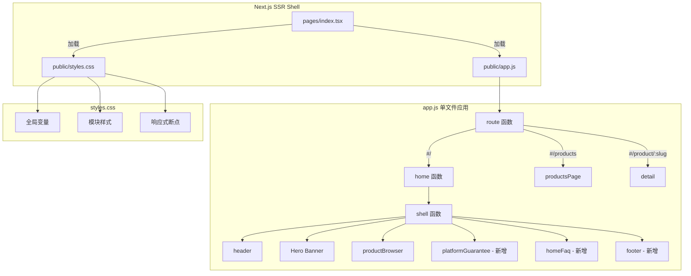
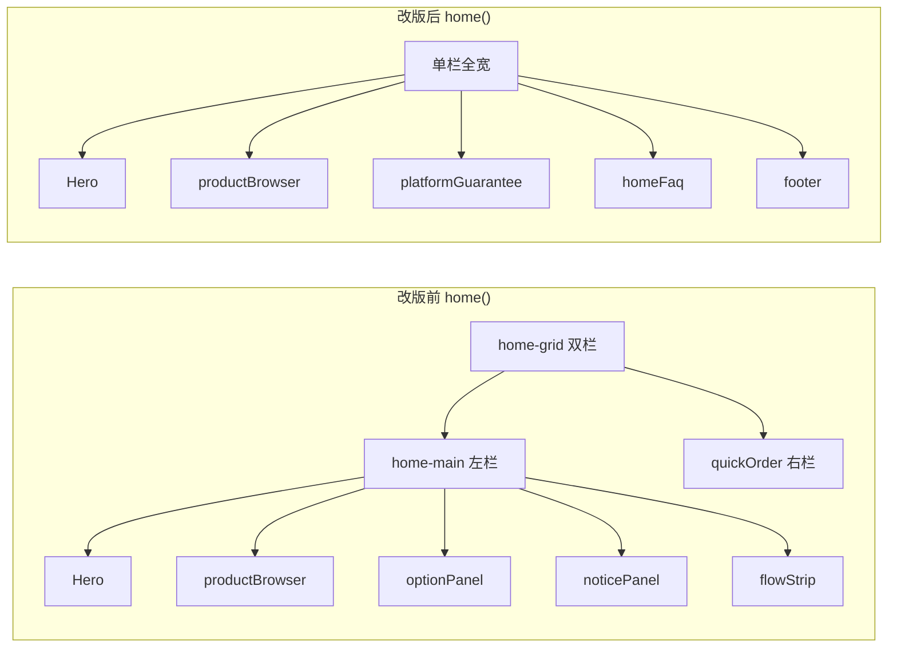
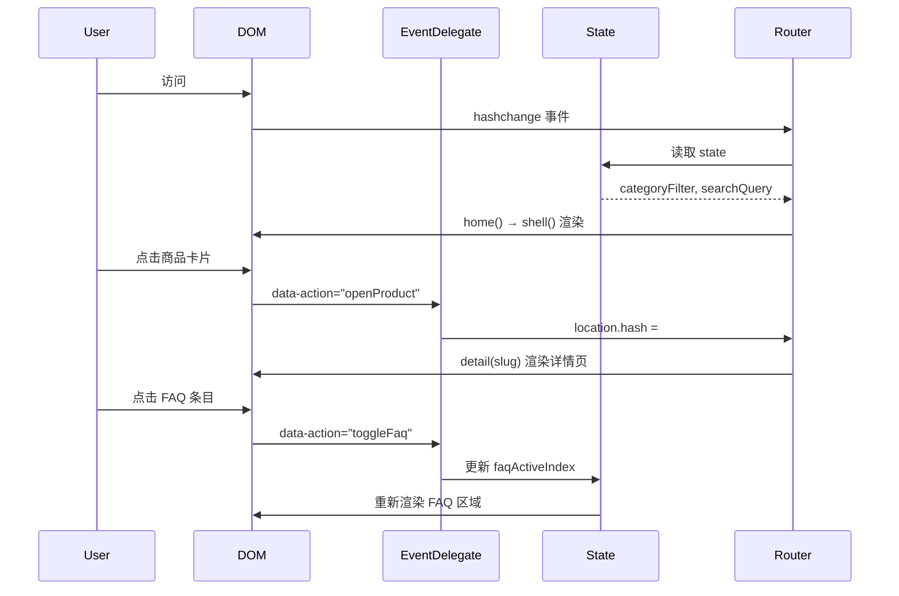

# 技术设计文档：Homepage Redesign

## Overview

本次改版将 ichuhai 虚拟商城首页从"商品发现 + 规格选择 + 快速下单"的混合职责页面，重构为职责单一的**纯商品广场首页**。核心变更包括：

1. **布局重构**：移除 `home-grid` 双栏布局，改为单栏全宽布局
2. **职责剥离**：从 `home()` 中移除 `quickOrder()`、`optionPanel()`、`noticePanel()`、`flowStrip()` 的调用
3. **交互变更**：商品卡片点击行为从"选中更新面板"改为"跳转详情页"
4. **新增模块**：`platformGuarantee()`、`homeFaq()`、`footer()` 三个新函数

技术栈保持不变：单文件前端应用（`app.js` + `styles.css`），通过 Next.js SSR 壳加载，非 React 组件化项目。所有 UI 通过模板字符串拼接 HTML，事件通过全局事件委托处理。

---

## Architecture

### 系统架构概览



### 改版前后对比



### 数据流



---

## Components and Interfaces

### 修改的函数

#### `home()`

**改版后签名不变，内部实现重构：**

```javascript
function home() {
  shell(`
    <section class="hero">
      <!-- Hero Banner 内容保持不变 -->
    </section>
    ${productBrowser()}
    ${platformGuarantee()}
    ${homeFaq()}
    ${footer()}
  `, 'page');
}
```

**关键变更：**
- 移除 `const item = product()` 和 `const sku = findSku(item)` 的调用（首页不再需要选中商品状态）
- 移除 `<section class="home-grid">` 包裹
- 移除 `quickOrder(item, sku)`、`optionPanel(item)`、`noticePanel(item)`、`flowStrip()` 调用
- 新增 `platformGuarantee()`、`homeFaq()`、`footer()` 调用

#### `card(item)`

**改版后变更：**

```javascript
function card(item) {
  const sku = findSku(item, defaultOptions(item)) || item.skus[0];
  const spec = sku ? Object.values(sku.optionValues).join(' · ') : '规格待选';
  const deliveryClass = item.deliveryType === 'auto' ? 'auto' : item.deliveryType === 'mixed' ? 'mixed' : 'manual';
  const stock = sku.stockStatus || sku.stock;
  return `
    <a class="product-card" href="#/products/${item.slug}">
      ${icon(item.icon)}
      <b>${item.name}</b>
      <span class="product-spec">${spec}</span>
      ${price(sku.priceUsdt)}
      <span class="product-badges">
        <small>${item.category}</small>
        <em class="${deliveryClass}">${deliveryLabel(item.deliveryType)}</em>
        <i class="stock ${stock}">${stockLabel(stock)}</i>
      </span>
    </a>
  `;
}
```

**关键变更：**
- `<button>` 改为 `<a href="#/products/${item.slug}">`，实现点击跳转
- 移除 `data-action="openProduct"` 和 `data-slug` 属性
- 移除 `selected` 类名判断和 `✓` 勾选标记
- 保留所有展示字段不变

#### `productBrowser(full = false)`

**首页模式变更：**
- 移除高级筛选控件（发货筛选、排序、仅看有货）在首页模式下的渲染
- 在商品列表下方添加"查看全部商品 →"文字链接（替代当前的 `›` 圆形按钮）

### 新增函数

#### `platformGuarantee()`

```javascript
function platformGuarantee() {
  return `
    <section class="platform-guarantee glass">
      <h3 class="guarantee-title">平台保障</h3>
      <div class="guarantee-items">
        <div class="guarantee-item">
          ${featureIcon('B02_shield_secure_payment.png', '安全可靠')}
          <b>安全可靠</b>
          <p>资金加密托管，交易安全有保障</p>
        </div>
        <div class="guarantee-divider"></div>
        <div class="guarantee-item">
          ${featureIcon('B01_lightning_instant_delivery.png', '极速秒发')}
          <b>极速秒发</b>
          <p>自动化系统，秒级交付到手</p>
        </div>
        <div class="guarantee-divider"></div>
        <div class="guarantee-item">
          ${featureIcon('B03_headset_support.png', '专业服务')}
          <b>专业服务</b>
          <p>7×24 小时在线客服支持</p>
        </div>
      </div>
    </section>
  `;
}
```

#### `homeFaq()`

```javascript
function homeFaq() {
  const faqs = [
    { icon: 'user', q: '购买需要登录吗？', a: '...' },
    { icon: 'credit-card', q: '支持哪些支付方式？', a: '...' },
    { icon: 'receipt', q: '如何查询订单？', a: '...' },
    { icon: 'lightning', q: '发货速度有多快？', a: '...' },
    { icon: 'refund', q: '可以退款吗？', a: '...' },
    { icon: 'headset', q: '遇到问题如何联系客服？', a: '...' }
  ];
  const activeIndex = state.homeFaqActive ?? 0;
  return `
    <section class="home-faq">
      <div class="faq-left">
        <h2>常见问题</h2>
        <p>我们致力于为全球用户提供安全、快速、可靠的数字商品服务。</p>
        <div class="faq-trust-stats">...</div>
        <a class="faq-contact" href="https://t.me/..." target="_blank">还有问题？联系我们 →</a>
      </div>
      <div class="faq-right">
        ${faqs.map((f, i) => `
          <div class="faq-item ${i === activeIndex ? 'active' : ''}" data-action="toggleFaq" data-index="${i}">
            <div class="faq-header">
              ${lineIcon(f.icon, f.q, 'faq-icon')}
              <span>${f.q}</span>
              ${lineIcon('chevron', '展开', 'faq-chevron')}
            </div>
            ${i === activeIndex ? `<div class="faq-answer">${f.a}</div>` : ''}
          </div>
        `).join('')}
      </div>
    </section>
  `;
}
```

**状态管理：** 在 `state` 对象中新增 `homeFaqActive: 0` 字段，控制当前展开的 FAQ 条目索引。值为 `null` 时表示全部折叠。

#### `footer()`

```javascript
function footer() {
  return `
    <footer class="site-footer">
      <span class="footer-brand">ichuhai</span>
      <span class="footer-slogan">全球数字商品，一站式秒发</span>
      <span class="footer-copyright">© 2024 ichuhai.com All rights reserved.</span>
    </footer>
  `;
}
```

### 事件处理扩展

在全局 `click` 事件委托中新增：

```javascript
if (action === 'toggleFaq') {
  const index = Number(el.dataset.index);
  state.homeFaqActive = state.homeFaqActive === index ? null : index;
  // 局部重渲染 FAQ 区域或全页重渲染
  return route();
}
```

移除或修改：
- `openProduct` action 不再设置 `state.selectedProductId`，因为卡片改为 `<a>` 标签直接跳转

---

## Data Models

### State 变更

```javascript
const state = {
  // ... 现有字段保持不变 ...
  
  // 移除首页依赖（字段保留，但 home() 不再读取）：
  // selectedProductId — 仅详情页/结算页使用
  // selectedOptions — 仅详情页/结算页使用

  // 新增字段：
  homeFaqActive: 0  // 当前展开的 FAQ 条目索引，null 表示全部折叠，默认 0（展开第一条）
};
```

### FAQ 数据结构

```javascript
const HOME_FAQS = [
  {
    icon: 'user',        // LINE_ICONS 中的 key
    question: '购买需要登录吗？',
    answer: '不需要。您可以直接选择商品并完成支付...'
  },
  {
    icon: 'credit-card',
    question: '支持哪些支付方式？',
    answer: '我们支持 USDT（TRC20/ERC20/BEP20）...'
  },
  {
    icon: 'receipt',
    question: '如何查询订单？',
    answer: '点击顶部导航"订单查询"，输入订单号或邮箱...'
  },
  {
    icon: 'lightning',
    question: '发货速度有多快？',
    answer: '自动发货商品在支付确认后秒级交付...'
  },
  {
    icon: 'refund',
    question: '可以退款吗？',
    answer: '数字商品一经发货不支持退款...'
  },
  {
    icon: 'headset',
    question: '遇到问题如何联系客服？',
    answer: '您可以通过 Telegram 联系我们的客服团队...'
  }
];
```

### 平台保障数据结构

```javascript
const GUARANTEE_ITEMS = [
  { icon: 'B02_shield_secure_payment.png', title: '安全可靠', desc: '资金加密托管，交易安全有保障' },
  { icon: 'B01_lightning_instant_delivery.png', title: '极速秒发', desc: '自动化系统，秒级交付到手' },
  { icon: 'B03_headset_support.png', title: '专业服务', desc: '7×24 小时在线客服支持' }
];
```

### LINE_ICONS 扩展

需要在 `LINE_ICONS` 对象中新增以下图标 key（用于 FAQ 条目）：

```javascript
const LINE_ICONS = {
  // ... 现有图标 ...
  'user': '<path d="M20 21v-2a4 4 0 0 0-4-4H8a4 4 0 0 0-4 4v2"/><circle cx="12" cy="7" r="4"/>',
  'credit-card': '<rect width="20" height="14" x="2" y="5" rx="2"/><line x1="2" x2="22" y1="10" y2="10"/>',
  'receipt': '<path d="M4 2v20l2-1 2 1 2-1 2 1 2-1 2 1 2-1 2 1V2l-2 1-2-1-2 1-2-1-2 1-2-1-2 1Z"/><path d="M8 10h8"/><path d="M8 14h4"/>',
  'lightning': '<path d="M13 2 3 14h9l-1 8 10-12h-9l1-8z"/>',
  'refund': '<path d="M3 12a9 9 0 1 0 9-9 9.75 9.75 0 0 0-6.74 2.74L3 8"/><path d="M3 3v5h5"/>',
  'headset': '<path d="M3 18v-6a9 9 0 0 1 18 0v6"/><path d="M21 19a2 2 0 0 1-2 2h-1a2 2 0 0 1-2-2v-3a2 2 0 0 1 2-2h3zM3 19a2 2 0 0 0 2 2h1a2 2 0 0 0 2-2v-3a2 2 0 0 0-2-2H3z"/>'
};
```

---

## Correctness Properties

*A property is a characteristic or behavior that should hold true across all valid executions of a system—essentially, a formal statement about what the system should do. Properties serve as the bridge between human-readable specifications and machine-verifiable correctness guarantees.*

### Property 1: 分类过滤正确性

*For any* 商品列表和任意分类标签，当用户选择该分类时，显示的商品列表中每一项的 `category` 字段都应等于所选分类。

**Validates: Requirements 4.3**

### Property 2: 搜索过滤正确性

*For any* 商品列表和任意非空搜索关键词，过滤后的结果中每一项的 `name`、`category` 或 `short` 字段中至少有一个包含该关键词（不区分大小写）。

**Validates: Requirements 4.5**

### Property 3: 分类与搜索交集

*For any* 商品列表、任意分类和任意搜索关键词，同时应用两个过滤条件后的结果应等于分别应用两个条件后取交集的结果。

**Validates: Requirements 4.6**

### Property 4: 商品卡片字段完整性

*For any* 有效商品对象，渲染后的卡片 HTML 应包含：商品名称、规格副标题、USDT 价格、法币折算价、分类标签、发货类型标签和库存状态标签。

**Validates: Requirements 5.2**

### Property 5: 商品卡片导航正确性

*For any* 商品对象，其渲染的卡片元素应包含指向 `#/products/{item.slug}` 的链接，且不包含 `selected` 类名或勾选标记。

**Validates: Requirements 5.3, 5.4**

### Property 6: FAQ 手风琴交互

*For any* FAQ 条目索引 i（0-5），点击该条目后：若该条目之前为折叠状态，则该条目变为展开且其余条目全部折叠；若该条目之前为展开状态，则该条目变为折叠。任何时刻最多只有一个条目处于展开状态。

**Validates: Requirements 7.5, 7.6**

---

## Error Handling

### 商品数据异常

| 场景 | 处理方式 |
|------|----------|
| 商品列表为空 | 显示 `<div class="empty-state">暂无匹配商品</div>` |
| 商品缺少 `slug` 字段 | 卡片链接降级为 `#/products/${item.id}` |
| 商品缺少 SKU | 显示"规格待选"，价格显示为 "—" |
| 所有 SKU 售罄 | 卡片正常渲染，库存标签显示"售罄"（红色），仍可点击跳转 |
| 商品图标加载失败 | `` 标签的 `loading="lazy"` + 浏览器默认 alt 文本兜底 |

### FAQ 交互异常

| 场景 | 处理方式 |
|------|----------|
| `state.homeFaqActive` 超出范围 | 重置为 `0`（展开第一条） |
| FAQ 数据为空数组 | 不渲染 FAQ 右侧区域 |

### 样式降级

| 场景 | 处理方式 |
|------|----------|
| CSS 加载失败 | HTML 语义化结构保证基本可读性 |
| 浏览器不支持 `backdrop-filter` | 使用纯色背景降级（已有 `rgba` 兜底） |
| 视口极窄（< 320px） | `min-width: 320px` 防止布局崩溃 |

---

## Testing Strategy

### 测试方法

本项目采用**双重测试策略**：

1. **单元测试（Example-based）**：验证具体场景、DOM 结构和边界条件
2. **属性测试（Property-based）**：验证过滤逻辑和渲染逻辑的通用正确性

### 属性测试配置

- **测试库**：fast-check（JavaScript PBT 库）
- **测试框架**：Vitest
- **最小迭代次数**：100 次/属性
- **标签格式**：`Feature: homepage-redesign, Property {N}: {property_text}`

### 属性测试覆盖

| Property | 测试目标 | 生成器 |
|----------|----------|--------|
| Property 1 | `visibleProducts()` 分类过滤 | 随机商品列表 + 随机分类 |
| Property 2 | `visibleProducts()` 搜索过滤 | 随机商品列表 + 随机查询字符串 |
| Property 3 | 过滤交集 | 随机商品列表 + 随机分类 + 随机查询 |
| Property 4 | `card(item)` 渲染完整性 | 随机有效商品对象 |
| Property 5 | `card(item)` 链接正确性 | 随机有效商品对象 |
| Property 6 | FAQ 状态机 | 随机初始状态 + 随机点击序列 |

### 单元测试覆盖

| 模块 | 测试内容 |
|------|----------|
| `home()` | DOM 中不含 quickOrder/optionPanel/noticePanel/flowStrip 元素 |
| `home()` | DOM 中不含 home-grid 类名 |
| `home()` | 模块渲染顺序正确（hero → productBrowser → guarantee → faq → footer） |
| `platformGuarantee()` | 渲染三项保障内容，标题和描述正确 |
| `homeFaq()` | 渲染 6 条 FAQ，默认展开第一条 |
| `homeFaq()` | 不含特定商品名称 |
| `footer()` | 包含品牌标识、口号和版权声明 |
| `card(item)` | 不含 selected 类名和 ✓ 标记 |
| 函数保留 | `quickOrder`、`optionPanel`、`noticePanel`、`flowStrip` 函数仍可调用 |

### CSS 测试

- 验证 `styles.css` 中不再包含 `.home-grid` 相关规则
- 验证新增 `.platform-guarantee`、`.home-faq`、`.site-footer` 样式存在
- 响应式断点（768px）下布局切换正确
